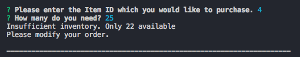

# bamazon

This program takes input from a user in order to place orders based on a mysql database that includes product id, name, department, price, and quantity:

The user selects an item via item_id and is then prompted on the quantity for the order. If their order does not exceed the quantity available in the database, the order is successful and the total cost is calculated:

The database is updated based on the order, in this example 10 toothpaste are orderd which deducts the database quantity from 500 to 490:

If the user places an order that exceeds the quantity available in the database, the order fails and the available quantity is displayed:

